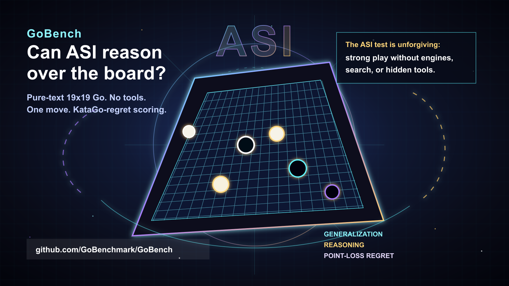

# GoBench: Testing LLMs on Strategic Go Reasoning



Can today's AI models actually reason about Go, or are they just fluent about Go?

GoBench is a compact benchmark for evaluating both the **generalization** and
**reasoning** abilities of AI models on 19x19 Go. A model receives a board
position in text, with no Go engine and no external tools, and must return one
legal next move. GoBench then scores the move by its point-loss regret relative
to KataGo's best move.

Go is an unusually sharp testbed for intelligence: the rules are simple, the
state space is enormous, local tactics interact with global judgment, and a
plausible-looking move can still lose the game by many points. A genuinely
superintelligent model should eventually be able to play Go from its own
reasoning, without calling tools, on par with systems such as KataGo. GoBench is
a small open step toward measuring that gap.

GoBench v0.1 is intentionally focused: static next-move prediction, pure text
input, legal move parsing, and KataGo-based point-loss scoring. It is designed
to be easy to run locally, hard to hand-wave, and honest about what is and is
not being measured.


> [!IMPORTANT]
> **Official results are API-only.** Public-dev is open and automatic; official
> results require the hidden `official_v0_1` suite, real KataGo scoring,
> preserved artifacts, and documented model API/API-gateway calls. `codex_exec`,
> shell agents, browser/computer-use automation, tool-assisted runs, mock
> scoring, and leaked hidden data are not accepted.

## 🔍 Metrics

- **GoBench Score:** a 0-100 display score derived from mean point loss. Higher
  is better.
- **Mean Point Loss / MPL:** average points lost by the model's move compared
  with KataGo's preferred move. Lower is better.
- **Legal Moves:** fraction of model outputs that parse as legal Go moves.
- **Top-10 Match:** fraction of model moves that appear in KataGo's top ten
  candidate moves for the position.
- **Blunder Rate:** fraction of moves whose point loss crosses the configured
  blunder threshold.
- **KataGo rank:** yellow numbered markers show KataGo's highest-ranked
  candidate moves on the board.
- **Model move:** the blue ring marks the move submitted by the evaluated
  model.

## 🎯 What GoBench Measures

- **Board understanding:** can the model parse and reason from a raw 19x19
  position?
- **Legal move discipline:** can it reliably produce valid Go coordinates?
- **Strategic judgment:** how many points does its move lose relative to
  KataGo's preferred move?
- **Robustness across phases:** opening, middle-game, and endgame positions are
  reported separately.
- **Benchmark hygiene:** public-dev is open and easy to submit; official
  results use hidden positions and fixed scorer settings.

This prototype is intentionally small. It does not implement full-game play,
Elo, image input, explanation grading, tool-assisted tracks, other board sizes,
handicap games, or human expert review. For governance, scorer settings, and
anti-contamination policy, see [`BENCHMARK.md`](BENCHMARK.md).

## 📊 Leaderboards

GoBench has two tracks:

- **Public-dev leaderboard:** an open community board for `public_dev` runs.
  It is easy to try, needs no approval, and valid open GitHub issues are ranked
  automatically. Submit with the
  [Public-Dev Result issue form](https://github.com/GoBenchmark/GoBench/issues/new?template=public-dev-result.yml)
  and view the board in [`leaderboards/public-dev.md`](leaderboards/public-dev.md).
- **Official hidden-suite leaderboard:** the serious benchmark board for the
  closed `official_v0_1` suite. It requires authorized hidden-suite access,
  real KataGo scoring, preserved artifacts, and maintainer review. View the
  board in [`leaderboards/official.md`](leaderboards/official.md).

<!-- GOBENCH_LEADERBOARDS_START -->

### Public-Dev Top 10

[Open full public-dev leaderboard](leaderboards/public-dev.md)

Last updated: `2026-06-18T20:21:49+00:00`

| Rank | Model | Provider | Score | MPL | Legal | Top-10 | Blunder | Count | Submitter | Issue |
|---:|---|---|---:|---:|---:|---:|---:|---:|---|---|
| - | No public-dev submissions yet | - | - | - | - | - | - | - | - | - |

### Official Top 10

[Open full official leaderboard](leaderboards/official.md)

| Rank | Model | Provider | Score | MPL | Legal | Top-10 | Blunder | Count | Review |
|---:|---|---|---:|---:|---:|---:|---:|---:|---|
| - | No approved official submissions yet | - | - | - | - | - | - | - | - |

<!-- GOBENCH_LEADERBOARDS_END -->

## ⚡ Quick Start

Install GoBench in an isolated environment:

```bash
git clone https://github.com/GoBenchmark/GoBench.git
cd GoBench
python3 -m venv .venv
source .venv/bin/activate
python -m pip install --upgrade pip
python -m pip install -e ".[dev]"
```

Run the test suite:

```bash
python -m pytest
```

Run a no-network smoke test against the bundled public-dev examples:

```bash
python -m gobench.cli eval-file \
  --positions data/public_dev/positions.jsonl \
  --predictions data/public_dev/example_predictions.jsonl \
  --labels data/public_dev/labels.jsonl
```

That command uses the checked-in example predictions and labels, so it works
without a provider API key or KataGo install. It is the fastest way to confirm
that the CLI, parser, legality checks, and metrics pipeline are working.

List the model and suite profiles:

```bash
python -m gobench.cli list-models
python -m gobench.cli list-suites
```

Diagnose your local setup:

```bash
python -m gobench.cli doctor
```

`doctor` reports whether your API key, output directory, and KataGo settings are
ready. It exits nonzero when required real-scoring pieces are missing. Missing
KataGo is fine for the no-network smoke test above; real benchmark claims
should use KataGo scoring.

## 🤖 Run a Model

Official leaderboard submissions are API-only. Use direct provider APIs or
compatible API gateways through GoBench model profiles; `codex_exec`, private
Codex runners, shell-based agent loops, browser/computer-use automation, and
other tool-using runtimes are not accepted as official results.

Configure a model profile once:

```bash
python -m gobench.cli list-presets

python -m gobench.cli configure --preset openai --api-key "$OPENAI_API_KEY"
python -m gobench.cli configure --preset claude-opus --api-key "$ANTHROPIC_API_KEY"
python -m gobench.cli configure --preset deepseek --api-key "$DEEPSEEK_API_KEY"
python -m gobench.cli configure --preset gemini --api-key "$GEMINI_API_KEY"
python -m gobench.cli configure --preset minimax --api-key "$OPENROUTER_API_KEY"
```

Use any OpenAI-compatible endpoint with explicit provider settings:

```bash
python -m gobench.cli configure \
  --provider openai-chat \
  --model provider/model-id \
  --api-base https://provider.example.com/v1 \
  --api-key-env PROVIDER_API_KEY \
  --api-key "$PROVIDER_API_KEY"
```

This writes two local files that are ignored by Git:

- `.gobench/model.yaml`: your default model profile.
- `.env.local`: your API/scorer environment settings.

Configure KataGo for real scoring:

```bash
export GOBENCH_SCORER=katago
export KATAGO_BIN=/path/to/katago
export KATAGO_MODEL=/path/to/model.bin.gz
export KATAGO_CONFIG=configs/katago_gobench_official.cfg
export KATAGO_MAX_VISITS=2048
export KATAGO_ANALYSIS_PV_LEN=12
```

Run the public-dev suite:

```bash
python -m gobench.cli doctor
python -m gobench.cli run \
  --suite suites/public_dev.yaml \
  --out data/runs/my-model-public-dev
```

After a successful `run`, GoBench writes `visualization/index.html` and opens it
in your browser by default. Use `--no-open` to write the HTML without opening a
browser, or `--no-visualize` to skip visualization entirely.

Build a local leaderboard from saved runs:

```bash
python -m gobench.cli leaderboard data/runs
```

<a id="official-benchmark-submissions"></a>

## 🏁 Official Benchmark Submissions

**Public-dev:** no approval needed. Run `suites/public_dev.yaml`, then open the
[Public-Dev Result issue form](https://github.com/GoBenchmark/GoBench/issues/new?template=public-dev-result.yml).
Valid open issues are ranked automatically in
[`leaderboards/public-dev.md`](leaderboards/public-dev.md).

**Official:** serious benchmark results use the closed `official_v0_1` suite
and maintainer review.

1. Open the
   [Official Submission Request issue form](https://github.com/GoBenchmark/GoBench/issues/new?template=official-submission.yml).
2. Wait for maintainer approval. If approved, the maintainer grants your GitHub
   account read access to the private
   [`GoBenchmark/gobench-official-suite`](https://github.com/GoBenchmark/gobench-official-suite)
   repository. The link may show `404` until access is granted.
3. Clone the private suite repo and copy the hidden positions into your local
   public GoBench checkout:

```bash
mkdir -p data/official_v0_1
cp /path/to/gobench-official-suite/data/official_v0_1/positions.jsonl \
  data/official_v0_1/positions.jsonl
```

4. Run the official suite and create a submission bundle:

```bash
export GOBENCH_SCORER=katago
export KATAGO_BIN=/path/to/katago
export KATAGO_MODEL=/path/to/model.bin.gz
export KATAGO_CONFIG=configs/katago_gobench_official.cfg
export KATAGO_MAX_VISITS=2048
export KATAGO_ANALYSIS_PV_LEN=12

RUN_DIR=data/runs/your-model-official-v0-1

python -m gobench.cli run \
  --model-profile .gobench/model.yaml \
  --suite suites/official_v0_1.yaml \
  --out "$RUN_DIR" \
  --no-visualize

python -m gobench.cli bundle-submission "$RUN_DIR"

sha256sum "$RUN_DIR-submission.tar.gz" 2>/dev/null || shasum -a 256 "$RUN_DIR-submission.tar.gz"
```

5. Return to the GitHub issue and paste only aggregate metrics, prompt hash,
   scorer settings, run metadata, and archive SHA-256.

Do not publish hidden-suite positions, labels, prompts containing hidden
positions, visualization artifacts, or raw hidden-suite run artifacts. For the
full checklist, see [`docs/submission.md`](docs/submission.md).

## ⚙️ Useful Commands

```bash
# Resume a partially completed run
python -m gobench.cli run --suite suites/public_dev.yaml --out data/runs/my-model-public-dev --continue-existing

# Generate and score separately
python -m gobench.cli generate --suite suites/public_dev.yaml --out data/runs/my-model-public-dev
python -m gobench.cli score --suite suites/public_dev.yaml --run-dir data/runs/my-model-public-dev

# Score custom predictions
python -m gobench.cli score --suite suites/public_dev.yaml --predictions path/to/predictions.jsonl --out data/runs/custom-model-public-dev

# Reopen visualization
python -m gobench.cli visualize data/runs/my-model-public-dev --open
```

Each run directory contains `run.json`, `predictions.jsonl`,
`raw_responses.jsonl`, `results.jsonl`, `metrics.json`, and `report.md`.

## ⚖️ KataGo Scoring

Mock scoring exists only for smoke tests. Benchmark-style results should use
real KataGo scoring:

```bash
export GOBENCH_SCORER=katago
export KATAGO_BIN=/path/to/katago
export KATAGO_MODEL=/path/to/model.bin.gz
export KATAGO_CONFIG=configs/katago_gobench_official.cfg
export KATAGO_MAX_VISITS=2048
export KATAGO_ANALYSIS_PV_LEN=12
```

Use `python -m gobench.cli doctor` to verify your model profile, API key,
output directory, and KataGo setup. For details, see
[`docs/katago.md`](docs/katago.md).

## 📚 More Docs

- [`docs/submission.md`](docs/submission.md): public-dev and official
  submission checklist.
- [`BENCHMARK.md`](BENCHMARK.md): governance, anti-contamination, and official
  scorer policy.
- [`docs/metrics.md`](docs/metrics.md): metric definitions and scoring notes.
- [`data/public_dev/README.md`](data/public_dev/README.md): public development
  suite details.

## ✅ Credibility Checklist

Before treating a run as a benchmark result:

- Run `python -m gobench.cli doctor --model-profile ... --suite ...`.
- Generate moves through a documented model API profile, not `codex_exec`,
  private Codex runners, shell agents, or tool-using automation.
- Use a versioned suite profile such as `suites/public_dev.yaml`.
- Use real KataGo scoring, not the mock scorer.
- Prefer `configs/katago_gobench_official.cfg` for reproducibility.
- Keep `run.json`, `predictions.jsonl`, `raw_responses.jsonl`, `results.jsonl`, `metrics.json`, and `report.md`.
- Report whether the suite is public-dev or official-hidden.
- Treat public-dev scores as community/debug results, not official hidden-suite
  claims.
- For official leaderboard claims, follow the
  `Official Benchmark Submissions` section above and `docs/submission.md`.
